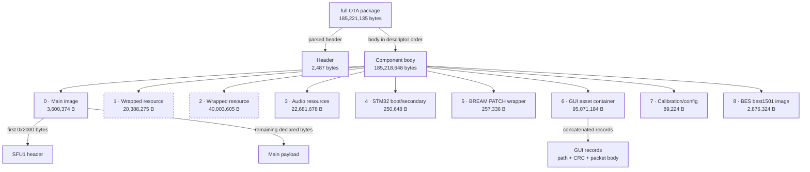
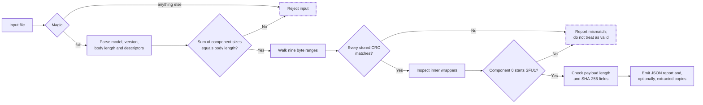
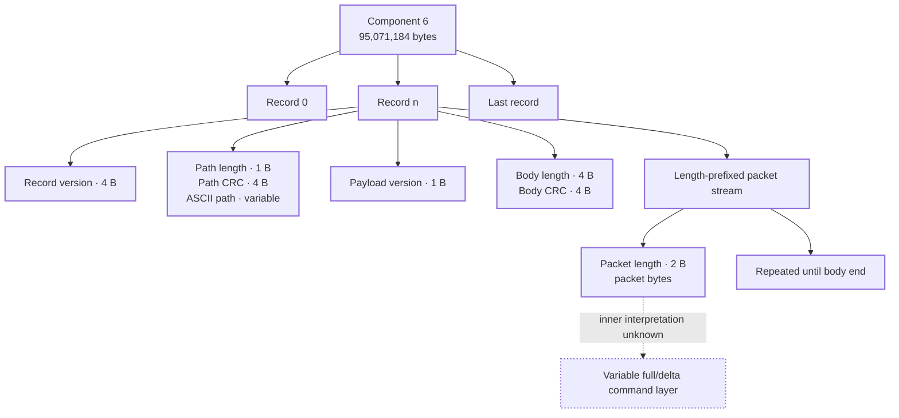
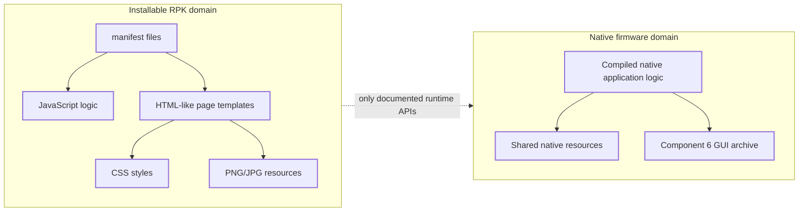

# Evidence-backed architecture

This page replaces the earlier simplified concept sketch. That sketch connected the phone, BES image, and STM32 image as if the complete runtime message path had been proved. It had not. The diagrams below show only relationships supported by parsed package structure, embedded markers, cross-references, or repeatable device observations.

For exact component sizes, see [Research data and charts](research-data.md#full-package-component-sizes).

## Reading the maps

Every diagram uses the following evidence vocabulary:

- **Observed:** directly parsed bytes, a verified checksum, an embedded marker, or behavior reproduced on the device.
- **Inferred:** the best current explanation of several observations, but not confirmed by vendor symbols or source code.
- **Unknown:** a field or relationship deliberately left unnamed.

Solid arrows mean structural containment or ordering proved by the package parser. Dashed arrows mean a research relationship or inference and are labeled accordingly.

## Verified OTA containment map



### Why these edges are real

The `full` parser reads the declared body length, calculates the header length from the file size, then reads nine descriptors. The sum of the nine component sizes equals the body length exactly. Each component begins at the end of the previous component, and all stored CRC values match the corresponding extracted region in the documented package. This proves **containment and order**. It does not prove every component's runtime responsibility.

The labels for components 1 and 2 remain deliberately broad. Their wrappers and sizes are observed; their exact user-facing role is not.

## Package validation chain



This is the actual decision sequence implemented by `tools/firmware_pkg.py`. The extractor writes new files only when requested; it never modifies the input package.

## Main-image load-region maps

The SFU component cannot safely be modeled with one universal base. Earlier
assistant work found a region where pointers satisfy:

```text
runtime_address = 0x08000000 + file_offset
file_offset     = runtime_address - 0x08000000
```



```mermaid
flowchart LR
  O[File offset<br/>0x0013024C] -->|add 0x08000000| A[Runtime address<br/>0x0813024C]
  A -->|encode little-endian pointer| P[4C 02 13 08]
  P -->|search main image| L[Literal-pool occurrences]
  L -->|decode nearby Thumb LDR| X[Candidate cross-reference]
  X -->|verify control flow and callers| V[Evidence-backed function context]

  classDef observed stroke-width:2px;
  class O,A,P,L,X,V observed;
```

Examples checked in the analyzed build:

| File offset | Runtime address | Use |
|---:|---:|---|
| `0x0013024c` | `0x0813024c` | native assistant handler region |
| `0x00130358` | `0x08130358` | address inside the same handler neighborhood |
| `0x002eda06` | `0x082eda06` | independent mapping check in a later region |

That relation remains valid for those verified offsets, but it is not global.
The independently traced `TSCFrameImage` region proves:

```text
file 0x001a56f4 → runtime 0x082056f4
file 0x00332c18 → runtime 0x08392c18
local delta                  0x08060000
```

The string pointer `0x08392c18` is stored literally at file offset
`0x001a570c`, and the nearby Thumb `ldr` at file offset `0x001a56f4` loads it.
This is stronger evidence than deriving a base from the reset vector alone.
Model verified load regions separately and record the pointer evidence for each.

## Native graphics containment map



The parser can split and rebuild this **outer structure** byte-for-byte. It cannot yet render the inner packet payload. Packet boundaries are observed, but calling each packet an animation frame would be an unsupported claim.

`TSCFrameImage` is a separate native file family: an eight-byte
width/height/frame-count header followed by fixed-size raw NEMA TSC6A frames.
See [Native graphics and TSCFrameImage](graphics-tscframeimage.md).

## Native and RPK software boundaries



The RPK structure is supported by Xiaomi/70mai framework documentation and inspected working packages. It does not imply that RPK JavaScript can access native C++ objects, Bluetooth internals, microphone streaming, or privileged watch actions. Each capability must be tied to a documented API or separately verified behavior.

## Runtime relationships still unknown

The package proves that a BES image and STM32-related images are delivered together. It does **not** yet prove:

- which processor terminates each Bluetooth profile;
- the exact inter-processor transport between BES and STM32 sides;
- whether assistant audio is encoded, buffered, or forwarded by one or both processors;
- which component owns every system service;
- whether a named asset is decoded directly by TouchGFX, a GPU layer, or an intermediate loader.

Those relationships should not be drawn as solid architecture arrows until traces, symbols, code paths, or controlled experiments establish them.

## How to verify or extend a map

1. Start with one proposed node or edge, not a whole subsystem.
2. State what evidence could prove it: marker, cross-reference, packet trace, call site, or controlled behavior.
3. Record model, version, file hash, component, offset, and command.
4. Try to disprove the relationship with an alternative explanation.
5. Mark it **inferred** until independent evidence closes the gap.
6. Update the diagram, prose, test fixture, and evidence table in one pull request.

See [Research methodology](research-methodology.md), [Lab notebook](lab-notebook.md), and [Concept maps](concept-maps.md) for complete templates.
