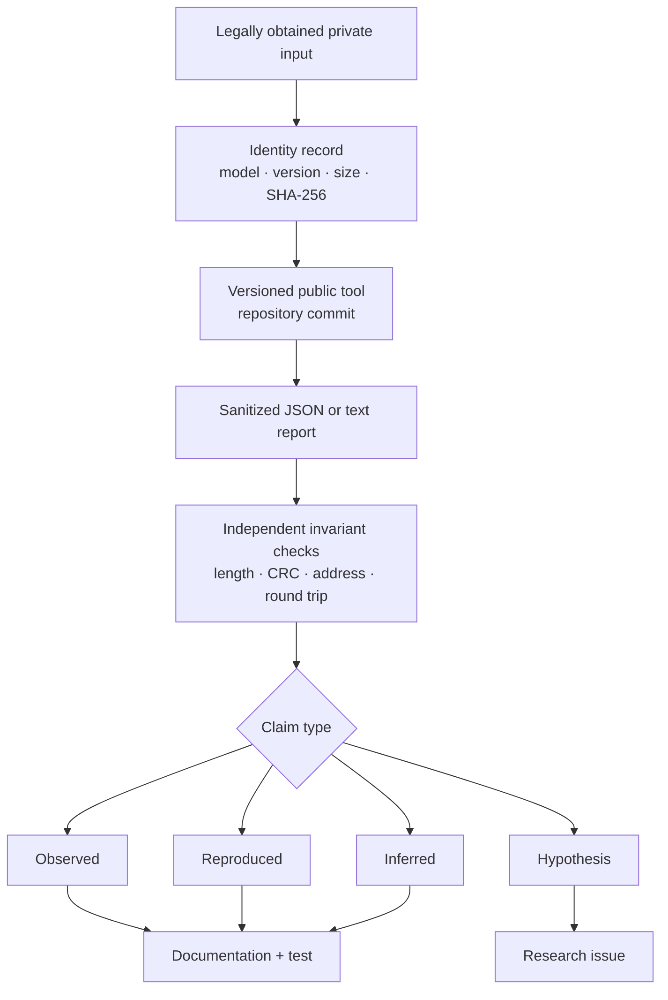
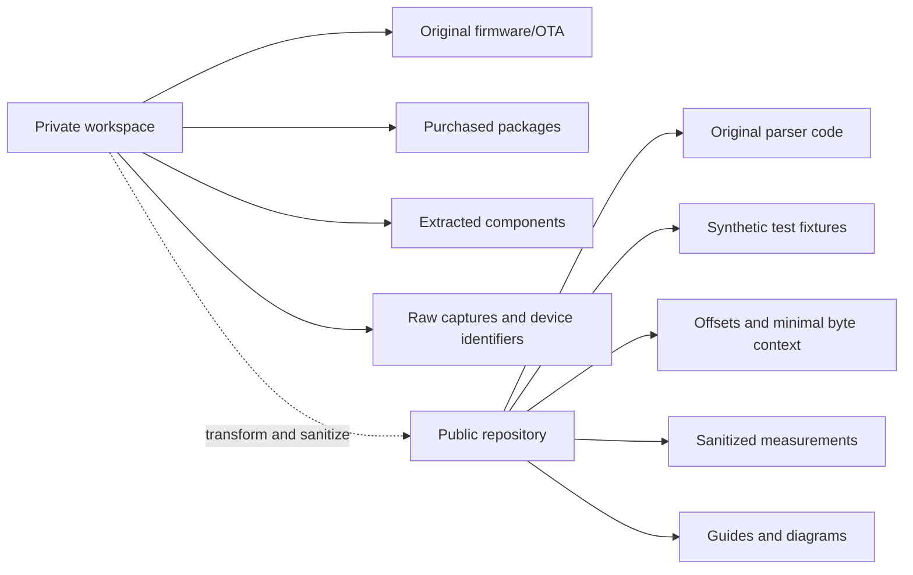
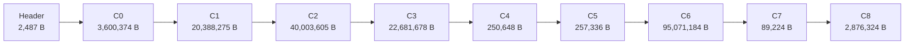
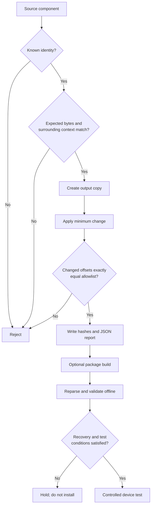
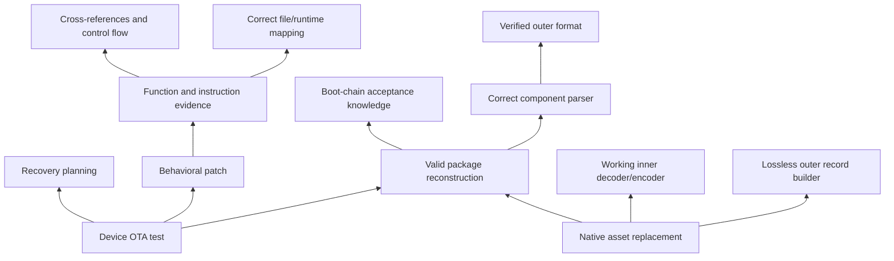
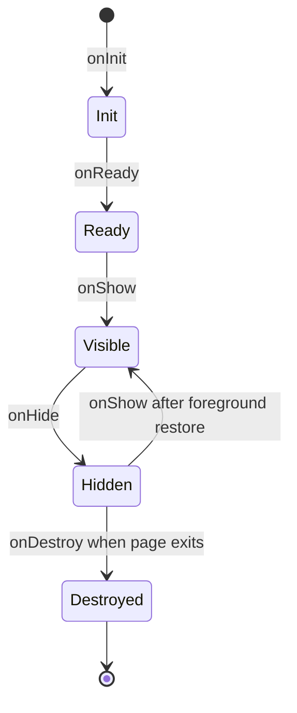
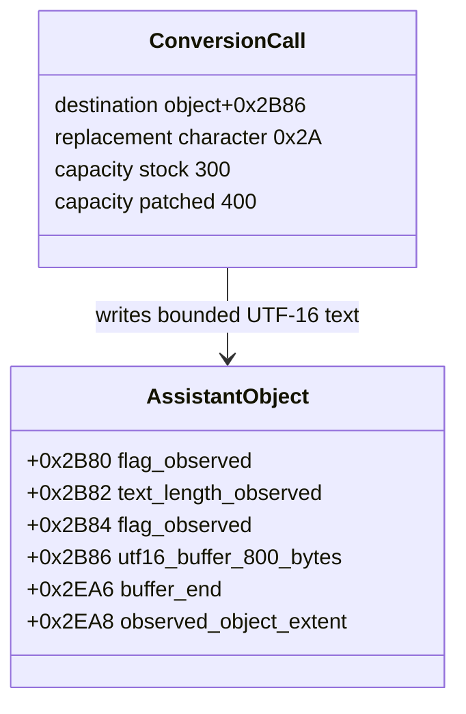

# Verified concept maps

These maps summarize the project without inventing missing architecture. Each relationship corresponds to a parser rule, verified byte mapping, documented framework rule, or explicit research dependency.

## Evidence production map

The map is also a review rule: a technical claim without an identified input, tool version, output, and check is not ready to be marked observed.

## Artifact ownership map

There is intentionally no arrow from the public repository back to ready-to-flash firmware. The project teaches reproducible analysis while excluding vendor and purchased binaries.

## Full-package byte layout

This is ordered containment from the documented stock package. The diagram is not drawn to scale; use the [component-size chart](research-data.md#full-package-component-sizes) for quantitative comparison.

## Patch trust chain

The repository's assistant-capacity patch implements the context, copy, exact-diff, and report stages. It does not automatically package or install anything.

## Firmware research dependency map

This dependency graph explains why “change a logo” can be harder than changing one numeric instruction: native artwork depends on an unresolved inner codec, while the text-capacity instruction uses a known fixed-width context.

## RPK lifecycle map

The following sequence comes from the public Xiaomi/70mai framework specification.

Opening another page can destroy the earlier page in the documented lightweight runtime; returning may create it again. Persistent state should not rely on a page object surviving navigation.

## Native assistant data structure map

The fields below were reconstructed from instruction behavior around the documented handler. Names describe observed use, not vendor source symbols.

The converter reserves a NUL code unit, so capacities 300 and 400 produce at most 299 and 399 visible characters respectively.

## Updating these maps

A map change must include:

1. the exact edge or node being changed;
2. evidence level before and after;
3. command, offset, hash, trace, or official source;
4. alternative explanations considered;
5. documentation and synthetic tests where applicable.

Do not make a map look complete by connecting unknown subsystems. An honest gap is more useful than a polished false relationship.
