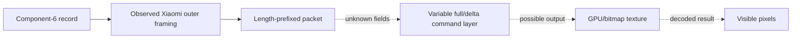

# Native GUI asset laboratory

This laboratory studies the variable-length packet records in component 6.
They are distinct from the now-decoded fixed-frame `TSCFrameImage` files. The
safe objective here is to prove the outer record format, catalog packet assets,
and design experiments that reveal their still-unknown inner opcodes.

## Evidence boundary

Currently verified:

- component 6 is exactly covered by concatenated records in stock `1.4.174`;
- each record has a path, CRC-protected body, and length-prefixed packet stream;
- the parser can split and byte-perfectly rebuild an unchanged record;
- native assistant paths identify listen, think, and transition assets;
- raw GPU texture output is not a drop-in replacement for these packet records;
- separately, `TSCFrameImage` uses an eight-byte header and raw fixed-size
  TSC6A frames, as documented in [Native graphics](graphics-tscframeimage.md).

Not yet verified:

- one packet equals one displayed frame;
- width, height, pixel format, or frame timing fields for every packet type;
- delta-frame opcode meanings;
- a general decoder or encoder for the variable-length packet family;
- safe replacement of boot-critical artwork.

## Step 1: catalog the package

```bash
python tools/asset_catalog.py \
  ../private-inputs/stock.pkg \
  --json-out ../generated/gui-assets.json
```

Optionally extract individual records into a private directory:

```bash
python tools/asset_catalog.py \
  ../private-inputs/stock.pkg \
  --extract-dir ../generated/gui-records \
  --json-out ../generated/gui-assets.json
```

The report should state:

- package component index and component size;
- record count;
- whether records cover the entire component;
- for each record: path, offsets, sizes, hashes, CRC state, packet count, unique packet count, and repetition statistics.

If records do not cover the entire component, do not assume the remainder is padding. Preserve and investigate it.

## Step 2: select a record by path

Choose a non-critical asset. Avoid boot logos, update UI, pairing UI, or the only visible recovery screen for initial experiments.

Search the JSON report:

```bash
python - <<'PY'
import json
from pathlib import Path

report = json.loads(Path("../generated/gui-assets.json").read_text())
for record in report["records"]:
    path = record["path"]
    if "alexa" in path.lower():
        print(record["index"], record["size"], record["length_prefixed_chunks"], path)
PY
```

This prints metadata only. It does not publish payload bytes.

## Step 3: split one outer record

```bash
python tools/gui_animation.py extract \
  ../generated/gui-records/your-record.bin \
  ../generated/one-record
```

The output contains:

```text
one-record/
├── animation.json
├── packet-0000.bin
├── packet-0001.bin
└── …
```

`animation.json` records path, payload version, packet order, size, and hash.

## Step 4: prove the lossless outer round trip

```bash
python tools/gui_animation.py rebuild \
  ../generated/one-record \
  ../generated/rebuilt-record.bin
```

Linux/WSL:

```bash
cmp ../generated/gui-records/your-record.bin ../generated/rebuilt-record.bin
sha256sum ../generated/gui-records/your-record.bin ../generated/rebuilt-record.bin
```

PowerShell:

```powershell
Get-FileHash "..\generated\gui-records\your-record.bin"
Get-FileHash "..\generated\rebuilt-record.bin"
```

Expected result: identical SHA-256 values and no `cmp` output. This proves the tool preserved bytes and packet order. It does not decode the picture.

## Step 5: compare packet-level metadata

Build a table for at least three records:

| Record | Total bytes | Packets | Unique packets | Repeated packets | First packet size |
|---|---:|---:|---:|---:|---:|
| A | | | | | |
| B | | | | | |
| C | | | | | |

Questions worth testing:

- Do packets at the same index share a fixed prefix?
- Are dimensions repeated in every packet or only the first?
- Do identical packet hashes correspond to visually repeated states?
- Does packet size correlate with visible complexity?
- Are there distinct full-frame and delta-like size clusters?

Correlation is not field identification. Keep alternative explanations.

## Step 6: create a synthetic hypothesis test

Suppose bytes `0..1` might be width. Do not rename them immediately. Write a test that:

1. parses those bytes from several private packets;
2. compares the value with independently known display dimensions;
3. checks endianness;
4. searches for the same value at other offsets;
5. rejects packets too short for the proposed field;
6. uses synthetic bytes in the public unit test.

A useful public fixture might be:

```python
packet = bytes.fromhex("01c801c8") + b"synthetic-payload"
```

The fixture must be invented, not copied from proprietary content.

## Step 7: distinguish texture formats from framing

TouchGFX officially supports several bitmap formats, including RGB565, RGB888, ARGB8888, indexed variants, and compressed forms. Ambiq GPU tooling can introduce other texture encodings. Neither fact proves the inner Xiaomi packet layout.

Keep layers separate:



An encoder for this packet family is complete only when it can reverse every
required layer accepted by that loader. The separate `TSCFrameImage` tool does
not satisfy this packet-codec requirement.

## Step 8: decoder before encoder

Recommended implementation order:

1. parse packet headers into named and `unknown_*` fields;
2. emit a structured report without rendering;
3. identify packet classes;
4. decode one known full-image payload;
5. export pixels to a standard format;
6. decode repeated/delta packets;
7. render a complete animation offline;
8. compare rendered output against a device recording;
9. implement inverse encoding;
10. rebuild a non-critical record and test only with recovery available.

## Device-test gate

Do not test a replacement unless all are true:

- original and output package identities are recorded;
- component and record sizes are intentionally handled;
- every outer CRC is recalculated and verified;
- the boot-chain/signature implication is understood for that package path;
- a non-critical asset was selected;
- battery and connection are stable;
- a recovery route has been independently verified as far as possible.

See [OTA safety](ota-safety.md) and [Recovery](recovery.md).
