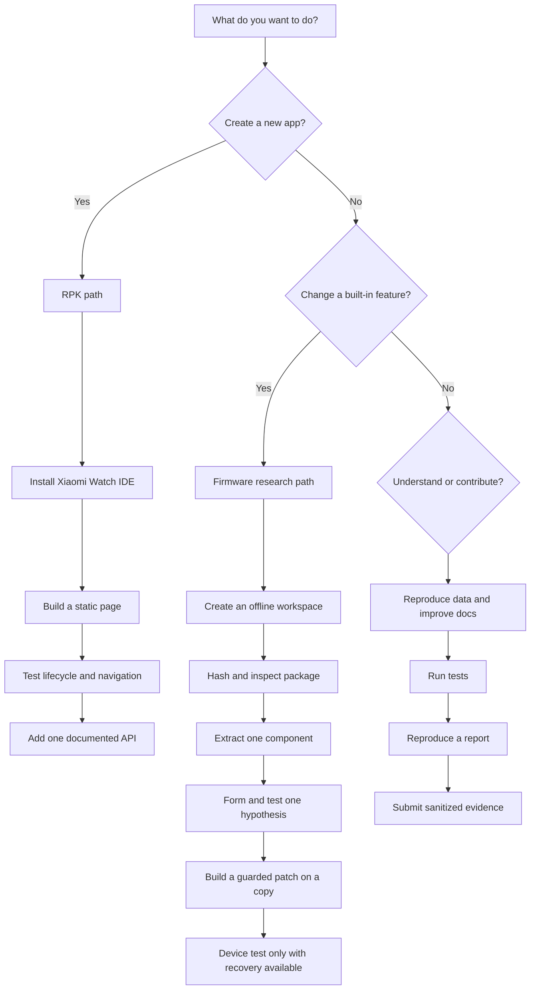

# Learning path

This guide can be approached without prior firmware experience, but the order matters. Do not begin with an OTA build. Begin by proving that you can identify an input, reproduce parser output, and explain one byte range.

## Choose your goal

## Path A: new installable application

Choose RPK when the goal is a new screen, utility, game, or phone-assisted feature that can operate through documented APIs. This path is safer because the app is installed and removed separately from system firmware.

Recommended order:

1. Read [RPK applications](rpk-apps.md) to understand the boundary.
2. Follow [Build an RPK from zero](rpk-tutorial.md).
3. Use only one page and one image for the first build.
4. Verify launch, close, swipe-back, physical-button behavior, suspend, resume, and uninstall.
5. Add one API at a time from the [official Xiaomi/70mai API reference](https://xiaomiwatch.70mai.com.cn/en/%E6%8E%A5%E5%8F%A3/).

Do not start by copying a large third-party app. A minimal project makes a black screen, unsupported component, or lifecycle problem diagnosable.

## Path B: inspect firmware without modifying it

This is the correct first firmware path for every contributor.

1. Follow [Windows and Linux setup](windows-setup.md).
2. Place legally obtained packages outside the Git repository.
3. Calculate SHA-256 and record the result.
4. Follow [Full-package walkthrough](full-package-walkthrough.md).
5. Compare your report with [Research data and charts](research-data.md).
6. Stop if model, version, count, sizes, or CRCs differ.

Completion means you can answer:

- Which exact file did I inspect?
- What format marker is present?
- Where does the body begin?
- How many components are declared?
- Do sizes and CRCs agree?
- Which statements are observed and which are inferred?

## Path C: compare versions or mods

Comparison is useful only when both inputs are identified and normalized.

1. Inspect both packages independently.
2. Compare metadata before extracted payloads.
3. Match components by index, type, size, and role evidence.
4. Calculate changed byte ranges rather than only a global hash.
5. Separate expected metadata changes from executable changes.
6. Follow cross-references for a small changed region.

Use [Firmware comparison](firmware-comparison.md) for exact commands and a report template.

## Path D: reverse engineer native code

You should already understand package extraction and address mapping.

1. Install Ghidra from its official release and a supported 64-bit JDK.
2. Import the extracted main component as raw ARM little-endian code.
3. Keep the file mapping at `0x08000000` for the documented build.
4. Do not analyze the whole binary as one uninterrupted code stream.
5. Use strings and `thumb_xrefs.py` to identify bounded regions.
6. Rename functions only when evidence supports the name.
7. Export offset, bytes, disassembly, and callers into the lab notebook.

Follow [Ghidra and ARM workflow](ghidra-workflow.md) step by step.

## Path E: native graphics

The fixed-frame `TSCFrameImage` format is decoded and can be authored with the
repository tools. The variable-length packet codec used by logo and assistant
animations remains a separate research target.

1. Catalog records without extracting copyrighted data into Git.
2. Select a non-critical record by path.
3. Split its outer packet stream.
4. Rebuild it unchanged and prove byte identity.
5. Compare packet headers across several locally held records.
6. Create synthetic fixtures for every proposed field.
7. Implement a decoder before an encoder.

Follow [GUI asset laboratory](gui-asset-lab.md). Do not begin with a boot logo or critical assistant asset.

## Milestones

| Level | You can… | You should not yet… |
|---|---|---|
| 0 · Reader | explain native vs RPK and identify the model | modify any binary |
| 1 · Reproducer | run tests and reproduce package metadata | change package fields |
| 2 · Analyst | map offsets, compare regions, document evidence | flash an experimental image |
| 3 · Patch author | write a guarded patch with synthetic tests | claim compatibility beyond tested builds |
| 4 · Device tester | run a controlled test with logs and recovery planning | distribute proprietary or universal images |

Progress is defined by reproducible evidence, not by how many tools were opened.
