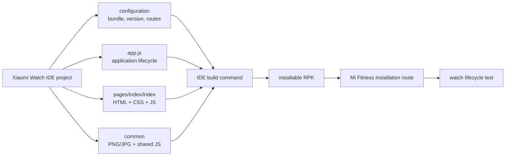

# Build an RPK from zero

This tutorial follows the public Xiaomi/70mai lightweight-watch framework. Tool versions differ, so prefer the template created by your installed IDE over manually inventing every manifest field.

## What you are building

An RPK app is a separately installable application containing configuration, JavaScript behavior, HTML-like page templates, CSS, and ordinary image resources. It is not a native firmware app and does not inherit native privileges.



## Step 1: install the official toolchain

Use the [Xiaomi Watch development-tools page](https://xiaomiwatch.70mai.com.cn/en/%E5%BC%80%E5%8F%91%E5%B7%A5%E5%85%B7/). Its documented flow is:

1. download and extract the Windows IDE;
2. configure the signing material generated for your own project;
3. start the IDE;
4. choose **File → New → Project → Js Project**;
5. run the project build command from the IDE terminal;
6. locate the generated RPK under the project's build output.

Keep private keys outside Git. Never use example passwords or identities from documentation for a real published app.

## Step 2: create the smallest project

Use a package identifier you control, for example:

```text
com.justnova23.watchhello
```

The official example shows the configuration shape:

```json
{
  "app": {
    "bundleName": "com.justnova23.watchhello",
    "version": {
      "code": 1,
      "name": "1.0"
    },
    "vendor": "Just-Nova23"
  },
  "module": {
    "js": [
      {
        "name": "default",
        "pages": ["pages/index/index"]
      }
    ]
  }
}
```

Do not replace the complete IDE-generated configuration with this abbreviated example. Preserve required `module`, `abilities`, device, icon, and API-version fields supplied by the template.

The homepage path is fixed as `pages/index/index` in the public framework specification.

## Step 3: understand the file tree

```text
project/
├── app.js
├── common/
│   └── logo.png
├── i18n/
│   └── en-US.json
└── pages/
    └── index/
        ├── index.html
        ├── index.css
        └── index.js
```

- `app.js` owns application lifecycle hooks.
- `pages` stores route pages.
- `common` stores shared scripts and media.
- `i18n` stores localized JSON resources and must not be renamed.
- page HTML defines structure, CSS defines supported styles, and JavaScript defines data and handlers.

Your IDE may wrap these files under a deeper module directory. Follow the generated project rather than moving files until the first build succeeds.

## Step 4: add application lifecycle logging

```javascript
export default {
  onCreate() {
    console.info("WatchHello app created");
  },
  onDestroy() {
    console.info("WatchHello app destroyed");
  },
};
```

The official framework defines `onCreate` and `onDestroy` for the application. Logs confirm that the runtime entered your code; they do not prove the page rendered.

## Step 5: create one static page

`pages/index/index.html`:

```html
<div class="page">
  <image class="logo" src="/common/logo.png"></image>
  <text class="title">Hello, watch</text>
  <text class="status">Static page loaded</text>
</div>
```

`pages/index/index.css`:

```css
.page {
  width: 100%;
  height: 100%;
  flex-direction: column;
  justify-content: center;
  align-items: center;
  background-color: #000000;
}

.logo {
  width: 72px;
  height: 72px;
}

.title {
  margin-top: 14px;
  font-size: 28px;
  color: #ffffff;
}

.status {
  margin-top: 8px;
  font-size: 18px;
  color: #aaaaaa;
}
```

`pages/index/index.js`:

```javascript
export default {
  onInit() {
    console.info("index onInit");
  },
  onReady() {
    console.info("index onReady");
  },
  onShow() {
    console.info("index onShow");
  },
  onHide() {
    console.info("index onHide");
  },
  onDestroy() {
    console.info("index onDestroy");
  },
};
```

The framework documents the initial page sequence as `onInit → onReady → onShow`. Hiding or leaving the page invokes `onHide`; destruction invokes `onDestroy`.

## Step 6: use resource paths correctly

The public framework recommends:

- relative paths for importing code, such as `../common/utils.js`;
- absolute resource paths, such as `/common/logo.png`;
- `url(/common/file.png)` inside CSS;
- no `../` traversal into protected storage.

For lightweight wearable API version 3+, the documentation lists BMP, JPEG, and PNG image support. Begin with a small ordinary PNG and avoid unsupported metadata or extreme dimensions.

## Step 7: build before adding APIs

Run the IDE template's build command, commonly exposed as `run.bat` in the IDE terminal according to the official tools guide.

Record:

- IDE version/archive date;
- project package name;
- API version from the generated configuration;
- build command;
- output filename and SHA-256;
- warnings and errors.

Do not suppress a compiler error by copying compiled files from another package.

## Step 8: test installation and lifecycle

Install through the same Mi Fitness workflow already proven to install compatible third-party RPKs. Then test in this order:

1. icon appears once and has the expected name;
2. app opens to the static page;
3. text and image are centered and not clipped;
4. physical button behavior is recorded;
5. swipe-back or platform exit behavior is recorded;
6. screen sleep and wake do not leave a black page;
7. reopening triggers the expected lifecycle;
8. uninstall removes the app and its private storage.

If the screen is black, revert to text only. A successful install proves package acceptance, not page compatibility.

## Step 9: add one interaction

HTML:

```html
<div class="page" onclick="changeMessage">
  <text class="title">{{message}}</text>
</div>
```

JavaScript:

```javascript
export default {
  data: {
    message: "Tap the screen",
  },
  changeMessage() {
    this.message = "Tap received";
  },
};
```

Verify event binding before adding routing, networking, phone communication, or animation.

## Step 10: add APIs defensively

The [official API reference](https://xiaomiwatch.70mai.com.cn/en/%E6%8E%A5%E5%8F%A3/) distinguishes synchronous and asynchronous calls. Asynchronous APIs may expose `success`, `fail`, `cancel`, and `complete` callbacks. Handle failure visibly and log error codes without exposing private data.

Before using an API, document:

- import module;
- minimum API version;
- parameters;
- callbacks and error codes;
- behavior when unavailable;
- device/firmware on which it was reproduced.

Never infer microphone, Bluetooth, or privileged action support from the existence of a similarly named system feature.

## Animation without native TSCFrameImage

RPK pages can use ordinary image resources. The framework's `image-animator` example passes an array of PNG paths and exposes start, pause, resume, and state methods through a referenced element. This is unrelated to the native component-6 `TSCFrameImage` format.

Start with two or three small images and a slow duration. Confirm memory use and lifecycle behavior before increasing frame count.

## Release checklist

- unique bundle name;
- intentional version code/name;
- private signing key excluded from source control;
- no copied proprietary assets;
- correct icon and localized app name;
- launch, exit, suspend, resume, and uninstall tested;
- unsupported capabilities hidden or explained;
- build hash recorded;
- source and license ready before public distribution.
